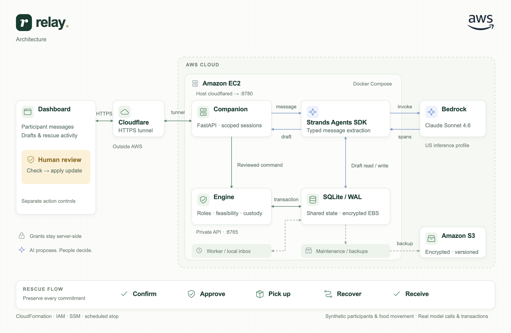

# Relay

**Keep the rescue moving.**

**[Watch the demo · 3:20](https://youtu.be/Bxe0k_bls9Y)** · **[Try the live workspace](https://instrument-generations-reduce-experiments.trycloudflare.com/)** · [View the architecture](docs/architecture/relay-architecture.png)

## Table of contents

- [Project overview](#project-overview)
- [What Relay does](#what-it-does)
- [External apps and services](#external-apps-and-services)
- [Local setup](#local-setup)
- [Connect AWS and Bedrock](#connect-aws-and-bedrock)
- [Architecture](#architecture)
- [How we tested reliability](#reliability-and-evaluation)
- [How we used Strands](#how-we-used-strands)
- [Current limitations](#current-limitations)
- [Deploy on AWS](#deploy-on-aws)
- [Demo video](#demo-video)
- [Repository contents](#repository-contents)
- [License and development provenance](#license-and-development-provenance)

## Project overview

Relay helps **food-rescue coordinators recover a broken commitment without discarding the commitments that still work**. It turns participant messages into reviewable updates, computes feasible assignments, collects revision-specific confirmations and tracks custody through replacement and recipient receipt.

Built for the Agents for Humans Hackathon, in the **Good Neighbor Agents** track. Relay is a working prototype with live **Strands Agents SDK and Claude Sonnet 4.6 on Amazon Bedrock**, deployed on EC2 with encrypted EBS storage and S3 backups. Participants, travel inputs and food movement are synthetic; model invocations and engine transitions are real.

## What it does

1. In **Messages & AI**, interprets a participant's message into a source-backed draft. Try Amara: “I am available. I can carry 16 crates and must finish by minute 85.” Sixteen crates normalize to 128 kg using the scenario's eight kilograms per crate.
2. Lets the coordinator review and apply the facts, generate a feasible plan, collect each participant's confirmation and separately approve dispatch.
3. Records pickups and tracks which participant holds the food.
4. Proposes a partial replacement when a driver cannot finish. Required responses are tied to the current plan revision.
5. Rejects a replacement with **CUSTODY_UNRESOLVED** while the failed driver still holds the food. After donor-return evidence, it can commit the replacement and preserve unaffected assignments and pickups.
6. Records the kitchen's receipt, completes the rescue, releases reservations and retains an activity log of decisions and rejected commands.

The demonstration starts with Tunde assigned 192 kg and Amara assigned 128 kg. Ada replaces Tunde after the returned load is recorded; Amara's work stays in place. The kitchen records a 320 kg receipt.

Each visitor receives an isolated synthetic network. Selecting a participant in the sandbox simulates a role; it does not authenticate a real person. The dashboard also supports editable facts, recalculation, cancellation acknowledgments and exact receipt quantities.

## External apps and services

| App or service | Role in Relay |
| --- | --- |
| Strands Agents SDK | Runs the bounded interpretation agent, model hook and request metrics. See [how we used Strands](#how-we-used-strands). |
| Amazon Bedrock / Claude Sonnet 4.6 | Interprets participant messages into typed proposals. |
| FastAPI and Pydantic | Serve the companion and private engine; validate commands and extracted facts. |
| SQLite/WAL on encrypted Amazon EBS | Persist commitments, custody, reservations, command receipts and durable work. |
| Amazon EC2 and Docker Compose | Host the companion, engine, worker and maintenance services. |
| Amazon S3 | Stores encrypted, versioned backups. |
| IAM, Systems Manager and CloudFormation | Provide runtime permissions, host operations and infrastructure definitions. |
| Cloudflare Tunnel | Provides the temporary public HTTPS endpoint. |
| Amazon Cognito and SES | Support separately rehearsed identity and email-response integrations; inactive in the public sandbox. |

## Local setup

Requirements: Python 3.12+ and [uv](https://docs.astral.sh/uv/). No Node build is needed for the current dashboard.

Clone the repository, then start the authenticated engine:

```sh
git clone https://github.com/Pavilion-devs/relay.git
cd relay
uv sync --locked
RELAY_DB=.data/judging.sqlite3 uv run uvicorn relay_core.api:app --host 127.0.0.1 --port 8765
```

In a second terminal from the same directory, start the companion against the **same database**:

```sh
RELAY_DB=.data/judging.sqlite3 \
RELAY_DEMO_API=http://127.0.0.1:8765 \
RELAY_DEMO_SECURE_COOKIE=0 \
uv run python demo/server.py
```

Open **http://127.0.0.1:8780**. The companion provisions session-scoped synthetic roles automatically; do not expose grant bundles in the browser. Structured operations work without AWS credentials. These commands are for local testing; do not publicly expose the private engine API or this HTTP development setup.

For local durable follow-up processing, an optional third terminal runs:

```sh
uv run python -m relay_core.worker --db .data/judging.sqlite3
```

## Connect AWS and Bedrock

Configure an AWS profile with access to `us.anthropic.claude-sonnet-4-6` and its supported foundation-model destinations. The caller needs the relevant `bedrock:InvokeModel` and `bedrock:CountTokens` permissions. Use your normal AWS sign-in flow; never commit credentials.

Restart only the companion with the additional environment settings:

```sh
AWS_PROFILE=relay AWS_REGION=us-east-1 RELAY_DEMO_AI=1 \
RELAY_DB=.data/judging.sqlite3 \
RELAY_DEMO_API=http://127.0.0.1:8765 \
RELAY_DEMO_SECURE_COOKIE=0 \
uv run python demo/server.py
```

This makes billable Bedrock requests in the configured AWS account. `demo/demo_ai.py` reserves a conservative maximum cost before each invocation, limits output and prevents automatic retries. Its persistent $1.50 allocation is per database; creating another database creates another allowance and is not an account-wide billing cap. The hosted instance uses its IAM role, not a developer's access keys. The core API's separate model endpoint remains disabled in the public deployment.

No model is substituted when AI is disabled or unavailable. The dashboard reports the limitation and leaves structured controls usable.

## Architecture



The dashboard submits messages to the companion. Strands and Bedrock produce an interpretation; deterministic validation turns it into a draft. A reviewed command reaches the private engine, which owns authorization, state transitions, custody checks and persistence.

The public companion keeps internal grants on the server. The engine API is not publicly routed. See the [implementation notes](docs/architecture.md), [diagram source](docs/architecture/relay-architecture.svg) and [runtime boundaries](docs/public-runtime.md).

## Reliability and evaluation

| Evidence | Verified result |
| --- | --- |
| Automated regression suite | **277 tests passed** on September 14, 2026. |
| Public AI interpretation | Live capacity/time drafts and a missing-units clarification; reviewed facts remain unchanged until application. |
| Complete browser workflow | AI draft → review → plan → confirmations → custody rejection → partial replacement → 320 kg receipt. |
| Partial recovery | Unaffected assignment and pickup preserved while replacing the failed driver's 192 kg portion. |
| Persistent metering | Reserved inference allowance survived companion recreation. |
| Separate integration rehearsals | Cognito participant login and SES email-response paths; these are outside the public sandbox. |

```sh
uv run pytest -q
uv run ruff check relay_core tests scripts demo
node --check demo/app.js
```

Node is optional and only needed for the JavaScript syntax check. Tests cover domain transitions, custody, stale revisions, duplicate/concurrent requests, permissions, persistence, SDK protocol behavior and metering. Scripted model tests are not live language-accuracy evidence.

See [public AI checks](docs/demo-public-ai-01.json) and [dashboard verification](docs/demo-dashboard-verification.json). Historical evaluation reports retain their original results and known failures; they are not combined into a single accuracy score. Synthetic rescues do not establish real-world impact or practitioner validation.

## How we used Strands

Relay uses `Agent` and `BedrockModel` from **Strands Agents SDK** for a single extraction attempt. A before-model-call hook bounds execution; request metrics record model calls and latency. The agent has no execution tools.

The interpretation path is:

```text
Participant message
        │
        ▼
Strands Agent → Claude on Amazon Bedrock
        │ source-backed extraction
        ▼
Pydantic + Python normalization
        │ draft or clarification
        ▼
Coordinator review and explicit application
        │ reviewed command
        ▼
Private recovery engine → durable receipt
```

Python verifies source spans, quantities, units, time boundaries and supported conditions. The engine independently checks roles, revisions, feasibility, confirmations and custody. An AI response does not approve dispatch or commit a replacement.

The reusable contribution is this separation between interpretation, reviewed facts and transactional recovery. AgentCore, DynamoDB and Amazon Location are not deployed here.

## Current limitations

- The solver is deliberately bounded: at most three available drivers and four recipients. Oversized problems escalate instead of being declared impossible.
- Travel matrices and handling inputs are supplied fixtures. This is not live navigation, a food-safety certification or real rescue-impact measurement.
- Post-receipt reconciliation, volume constraints and return-route planning are not implemented.
- Temporary browser sessions and finite public model quotas are demonstration controls, not a production identity or availability guarantee.
- A real-practitioner study and a matched comparison with other products have not been completed.

## Deploy on AWS

The hosted prototype uses one EC2 Linux host, Docker Compose, encrypted EBS and a private S3 backup bucket. The companion exposes the public sandbox; the engine remains private.

1. Review the [deployment package](deploy/README.md), [AWS launch procedure](deploy/aws-launch.md) and infrastructure templates in `infra/`.
2. Build and test the Linux amd64 container, provision encrypted persistent storage and configure the instance role and private backup bucket.
3. Install the verified release and initialize the shared database. The engine, companion, worker and maintenance services must use that same persistent store.
4. Configure the public companion using [compose.demo.yaml](deploy/compose.demo.yaml), enable only the required Bedrock permissions and set finite inference controls.
5. Verify readiness, backups, browser-session isolation and the complete recovery flow before sharing the HTTPS endpoint.

These are deployment instructions, not a one-command free hosting service. Cloud resources and live inference incur costs. Runtime credentials come from the instance role; local credentials, grants and databases stay out of Git.

The current host is scheduled to stop at **2026-10-09 01:00 UTC**. The temporary tunnel and finite model allowance remain availability limits. The local setup provides a reproducible alternative; see [public runtime](docs/public-runtime.md).

## Demo video

**[Watch the 3:20 demo on YouTube](https://youtu.be/Bxe0k_bls9Y)**

The video follows actual public-app interactions: a live AI draft, review, confirmations, pickup, a failed replacement blocked by custody, returned-food evidence, a successful partial replacement and the final receipt. The architecture section explains Strands, Bedrock and the private engine. Footage is edited for pacing; participants and food movement are synthetic.

[Open the live workspace](https://instrument-generations-reduce-experiments.trycloudflare.com/) or read the [presenter instructions](docs/demo-presenter-notes.md). A [downloadable video](docs/submission/relay-demo.mp4) is also included.

## Repository contents

- `demo/`: current functional dashboard, isolated companion API and metered live AI.
- `relay_core/`: interpretation, validation, planning, commitments, custody, partial recovery and durable execution.
- `tests/`, `evaluation/`: automated checks and synthetic language cases.
- `deploy/`, `infra/`: container packaging, host setup and AWS infrastructure definitions.
- `scripts/`: verification, evaluation and integration rehearsals.
- `docs/`: architecture, dated evidence, banner and demo assets.

Credentials, local grants, databases and private rehearsal artifacts stay outside the published source. The earlier React/Vinext `web/` prototype is local history and is not the active judging interface.

## License and development provenance

Relay is MIT licensed. It uses open-source libraries including Strands Agents SDK, boto3/botocore, FastAPI, Pydantic and SQLite; their respective licenses apply. The earlier `web/` prototype used a Sites-generated Vinext starter and associated UI components; that prototype is not the active judging interface. AI coding assistance was used to develop Relay. The synthetic scenarios and tests are development evidence, not practitioner-supplied data. The README banner and project cover were generated with AI.
